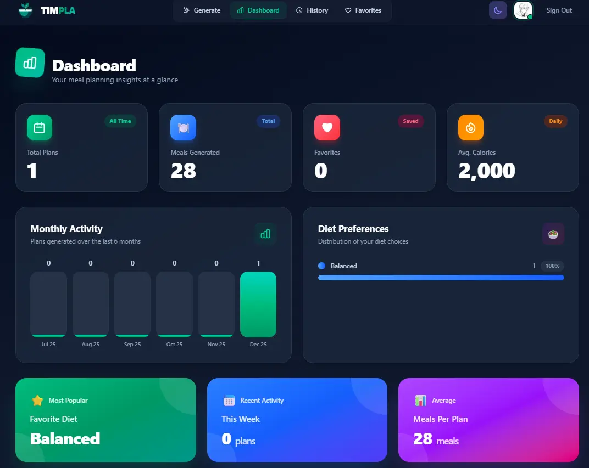

# TIMPLA 🥗

**Tailored Intelligent Meal Planning Lifestyle Assistant**

[](https://timpla.vercel.app/)

TIMPLA is a modern, AI-powered web application that helps you create personalized meal plans tailored to your lifestyle, dietary preferences, and health goals. Whether you're looking to maintain a healthy diet, manage specific dietary requirements, or explore new cuisines, TIMPLA generates customized meal plans just for you.



## ✨ Features

### Core Features
- **AI-Powered Meal Planning**: Generate personalized meal plans using Groq AI
- **Flexible Dietary Options**: Support for various diet types (balanced, vegetarian, vegan, keto, paleo, mediterranean, low-carb, high-protein)
- **Allergy Management**: Specify food allergies and dietary restrictions
- **Cuisine Preferences**: Choose from different cuisines and cooking styles
- **Customizable Duration**: Create 3, 5, 7, or 14-day meal plans

### New Features (v1.0)
- **Meal Plan History**: Save and access all your previously generated meal plans
- **Favorites System**: Bookmark your favorite meals for quick reference
- **Smart Shopping Lists**: AI-generated shopping lists organized by category
- **PDF Export**: Download and print your meal plans
- **Dashboard Analytics**: View statistics and insights about your meal planning habits
- **Dark Mode**: Full dark mode support across the entire application
- **Mobile Responsive**: Beautiful, modern UI optimized for all devices

### Subscription & Payments
- **Flexible Pricing**: Weekly, monthly, and yearly subscription options
- **Secure Authentication**: User login and profile management with Clerk
- **Payment Processing**: Secure subscription payments with Stripe

## 🚀 Tech Stack

- **Frontend**: Next.js 15, React 19, TypeScript
- **Styling**: Tailwind CSS v4
- **State Management**: TanStack React Query v5
- **Authentication**: Clerk
- **Database**: PostgreSQL with Prisma ORM
- **Payments**: Stripe
- **AI**: Groq API (LLaMA)
- **Notifications**: React Hot Toast
- **Deployment**: Vercel

## 📁 Project Structure

```
timpla/
├── app/
│   ├── api/                    # API routes
│   │   ├── checkout/           # Stripe checkout
│   │   ├── create-profile/     # Profile creation
│   │   ├── favorites/          # Favorites management
│   │   ├── generate-mealplan/  # AI meal generation
│   │   ├── mealplans/          # Meal plan CRUD
│   │   ├── profile/            # Profile management
│   │   ├── shopping-list/      # Shopping list generation
│   │   ├── stats/              # User statistics
│   │   └── webhook/            # Stripe webhooks
│   ├── create-profile/         # Profile creation page
│   ├── dashboard/              # Analytics dashboard
│   ├── favorites/              # Favorites page
│   ├── history/                # Meal plan history
│   ├── mealplan/               # Meal plan generator
│   ├── profile/                # User profile
│   ├── sign-up/                # Authentication
│   ├── subscribe/              # Subscription plans
│   ├── success/                # Payment success
│   ├── globals.css             # Global styles
│   ├── layout.tsx              # Root layout
│   └── page.tsx                # Home page
├── components/
│   ├── icons.tsx               # Icon components
│   ├── navbar.tsx              # Navigation bar
│   ├── react-query-client-provider.tsx
│   ├── skeleton.tsx            # Loading skeletons
│   ├── spinner.tsx             # Loading spinner
│   └── theme-toggle.tsx        # Dark mode toggle
├── lib/
│   ├── plans.ts                # Subscription plan definitions
│   ├── prisma.ts               # Prisma client
│   └── stripe.ts               # Stripe client
├── prisma/
│   └── schema.prisma           # Database schema
├── middleware.ts               # Route protection
└── public/                     # Static assets
```

## 🛠️ Getting Started

### Prerequisites

- Node.js 18+
- npm, yarn, or pnpm
- PostgreSQL database (Neon, Supabase, or local)
- Clerk account
- Stripe account
- Groq API key

### Installation

1. **Clone the repository**
   ```bash
   git clone https://github.com/your-username/timpla.git
   cd timpla
   ```

2. **Install dependencies**
   ```bash
   npm install
   ```

3. **Set up environment variables**
   Create a `.env` file in the root directory:
   ```env
   # Database
   DATABASE_URL="your_postgresql_connection_string"

   # Clerk Authentication
   NEXT_PUBLIC_CLERK_PUBLISHABLE_KEY="pk_test_xxxxx"
   CLERK_SECRET_KEY="sk_test_xxxxx"

   # Stripe Payments
   STRIPE_SECRET_KEY="sk_test_xxxxx"
   NEXT_PUBLIC_STRIPE_PUBLISHABLE_KEY="pk_test_xxxxx"
   STRIPE_WEBHOOK_SECRET="whsec_xxxxx"

   # Groq AI
   GROQ_API_KEY="your_groq_api_key"

   # App URL
   NEXT_PUBLIC_APP_URL="http://localhost:3000"

   # Stripe Price IDs (create products in Stripe dashboard)
   STRIPE_PRICE_WEEKLY="price_xxxxx"
   STRIPE_PRICE_MONTHLY="price_xxxxx"
   STRIPE_PRICE_YEARLY="price_xxxxx"
   ```

4. **Set up the database**
   ```bash
   npx prisma generate
   npx prisma db push
   ```

5. **Run the development server**
   ```bash
   npm run dev
   ```

6. **Open your browser**
   Navigate to [http://localhost:3000](http://localhost:3000)

## 📱 How to Use

1. **Sign Up**: Create an account using Clerk authentication
2. **Choose a Plan**: Select from weekly ($9.99), monthly ($39.99), or yearly ($299.99) subscription
3. **Generate Meal Plans**: Set your preferences (diet type, calories, allergies, cuisine) and generate AI-powered meal plans
4. **Save & Organize**: Save meal plans to history and bookmark favorite meals
5. **Shopping Lists**: Generate organized shopping lists from your meal plans
6. **Export**: Download meal plans as PDF for offline access
7. **Track Progress**: View your meal planning statistics on the dashboard

## 🎨 UI/UX Features

- **Modern Design**: Clean, professional interface with beautiful gradients and animations
- **Dark Mode**: Full dark/light theme support with system preference detection
- **Responsive Layout**: Optimized for desktop, tablet, and mobile devices
- **Loading States**: Skeleton loaders and spinners for better UX
- **Toast Notifications**: Real-time feedback for user actions
- **Intuitive Navigation**: Easy-to-use interface with mobile menu support

## 🔧 API Endpoints

### Meal Planning
- `POST /api/generate-mealplan` - Generate AI-powered meal plans
- `GET /api/mealplans` - Get all saved meal plans
- `POST /api/mealplans` - Save a new meal plan
- `GET /api/mealplans/[id]` - Get a specific meal plan
- `DELETE /api/mealplans/[id]` - Delete a meal plan
- `PATCH /api/mealplans/[id]` - Update meal plan name

### Favorites
- `GET /api/favorites` - Get all favorites
- `POST /api/favorites` - Add to favorites
- `DELETE /api/favorites?id=xxx` - Remove from favorites

### Shopping & Stats
- `POST /api/shopping-list` - Generate shopping list from meal plan
- `GET /api/stats` - Get user statistics and analytics

### Subscription
- `POST /api/checkout` - Create Stripe checkout session
- `GET /api/check-subscription` - Check subscription status
- `GET /api/profile/subscription-status` - Get subscription details
- `POST /api/profile/change-plan` - Change subscription plan
- `POST /api/profile/unsubscribe` - Cancel subscription
- `POST /api/webhook` - Stripe webhook handler

### Profile
- `POST /api/create-profile` - Create user profile

## 🗄️ Database Schema

```prisma
model Profile {
  id                   String      @id @default(uuid())
  userId               String      @unique
  email                String
  subscriptionActive   Boolean     @default(false)
  subscriptionTier     String?
  stripeSubscriptionId String?     @unique
  createdAt            DateTime    @default(now())
  updatedAt            DateTime    @updatedAt
  mealPlans            MealPlan[]
  favorites            Favorite[]
}

model MealPlan {
  id          String     @id @default(uuid())
  userId      String
  name        String     @default("Meal Plan")
  dietType    String
  calories    Int
  allergies   String?
  cuisine     String?
  days        Int
  snacks      Boolean    @default(true)
  planData    Json
  createdAt   DateTime   @default(now())
  updatedAt   DateTime   @updatedAt
  profile     Profile    @relation(...)
  favorites   Favorite[]
}

model Favorite {
  id         String   @id @default(uuid())
  userId     String
  mealPlanId String
  mealDay    String
  mealType   String
  mealName   String
  calories   Int?
  createdAt  DateTime @default(now())
  profile    Profile  @relation(...)
  mealPlan   MealPlan @relation(...)
}
```

## 🚀 Deployment

### Vercel Deployment

1. **Connect your repository** to Vercel
2. **Set environment variables** in Vercel dashboard
3. **Deploy** - Vercel will automatically build and deploy

### Required Environment Variables for Production

- All variables from `.env`
- Update `NEXT_PUBLIC_APP_URL` to your production domain
- Use live Stripe keys and Price IDs

### Build Command
```bash
npm run build
# or
prisma generate && next build
```

## 🔐 Security

- User authentication handled by Clerk
- Secure payment processing with Stripe
- Environment variables for sensitive data
- Route protection via middleware
- HTTPS enforced in production

## 🤝 Contributing

1. Fork the repository
2. Create a feature branch (`git checkout -b feature/amazing-feature`)
3. Commit your changes (`git commit -m 'Add amazing feature'`)
4. Push to the branch (`git push origin feature/amazing-feature`)
5. Open a Pull Request

## 📄 License

This project is licensed under the MIT License.

## 🆘 Support

If you encounter any issues or have questions:
1. Check the [Issues](https://github.com/your-username/timpla/issues) page
2. Create a new issue with detailed information

## ✅ Completed Features (v1.0)

- [x] AI-Powered Meal Planning
- [x] Meal Plan History
- [x] Favorites System
- [x] Shopping List Generator
- [x] PDF Export
- [x] Dashboard Analytics
- [x] Dark Mode Support
- [x] Mobile Responsive Design
- [x] Subscription Management
- [x] User Authentication

## 🎯 Roadmap

- [ ] Recipe details with step-by-step instructions
- [ ] Nutritional breakdown per meal
- [ ] Meal plan sharing (social features)
- [ ] Grocery store integration
- [ ] Mobile app (React Native)
- [ ] Meal prep calendar view
- [ ] Custom recipe creation

---

**TIMPLA** - *Tailored Intelligent Meal Planning Lifestyle Assistant*

Made with ❤️ for healthy eating and better nutrition
